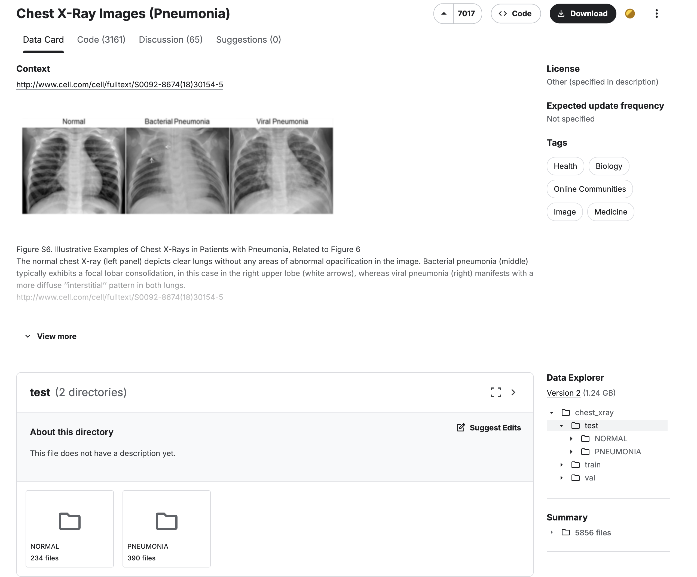

# DiagnoMind

## Takım İsmi

## Takım Üyeleri

## Uygulama İsmi
DiagnoMind

## Uygulama Açıklaması
DiagnoMind, hastanelerde veya kliniklerde çekilen X-ray (röntgen) ve benzeri tıbbi görüntüler üzerinden otomatik hastalık tanısı yapabilen ve genel bir tıbbi açıklama üreten yapay zeka destekli bir uygulamadır. Görselin sisteme yüklenmesiyle, AI modeli anomaliyi tanımlar ve Large Language Model (LLM) entegrasyonu sayesinde insan dilinde yorumlayarak kullanıcıya anlamlı bilgi sunar. Doktorların karar süreçlerini destekler, eğitim amaçlı kullanılabilir ve ikinci görüş hizmeti sağlar.

## Sprint 1: Planlama ve Veri Hazırlığı
- Proje hedefleri ve kapsamı belirlendi.
- Kullanılacak veri setleri araştırıldı ve seçildi (şuanda sadece zaatüre ile ilgili veriler mevcut).

- Python ortamı kuruldu, basit görsel yükleme ve gösterme prototipi geliştirildi.
- GitHub reposu oluşturuldu.

### Sprint Hedefi: Veri toplama ve temel altyapı kurulumu tamamlanarak, model eğitimi için hazırlıkların yapılması.

### Sprint Sonucu: Planlanan hedefler başarıyla tamamlandı, 1. sprint puanı: 10/10.
