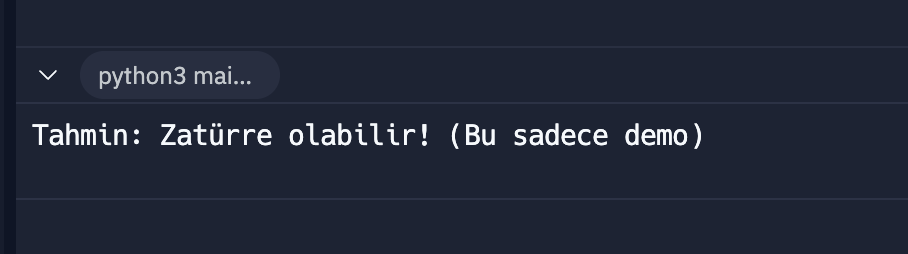

# DiagnoMind

## Takım İsmi

## Takım Üyeleri

## Uygulama İsmi

DiagnoMind

## Uygulama Açıklaması

DiagnoMind, hastanelerde veya kliniklerde çekilen X-ray (röntgen) ve benzeri tıbbi görüntüler üzerinden otomatik hastalık tanısı yapabilen ve genel bir tıbbi açıklama üreten yapay zeka destekli bir uygulamadır. Görselin sisteme yüklenmesiyle, AI modeli anomaliyi tanımlar ve Large Language Model (LLM) entegrasyonu sayesinde insan dilinde yorumlayarak kullanıcıya anlamlı bilgi sunar. Doktorların karar süreçlerini destekler, eğitim amaçlı kullanılabilir ve ikinci görüş hizmeti sağlar.

## Sprint 1: Planlama ve Veri Hazırlığı

- Proje hedefleri ve kapsamı belirlendi.
- Uygulama için kullanılacak veri setleri araştırıldı, zatürre (pnömoni) verisi uygun bulundu ve hazırlandı.


- Python ortamı kuruldu ve basit bir görsel işleme prototipi geliştirildi. Bu prototip, X-ray görsellerini okuyup ön işleme tabi tutuyor ve demo amaçlı basit tahminler üretiyor.

``` python
from PIL import Image
import numpy as np
import random

def load_and_preprocess(image_path):
    img = Image.open(image_path).convert("RGB")
    img = img.resize((150, 150))
    img_array = np.array(img) / 255.0
    img_array = img_array.flatten()
    return img_array

def dummy_predict(image_array):
    return random.choice([0, 1])

if __name__ == "__main__":
    image_path = "IM-0001-0001.jpeg"  
    try:
        img_array = load_and_preprocess(image_path)
        pred = dummy_predict(img_array)

        if pred == 1:
            print("Tahmin: Zatürre olabilir! (Bu sadece demo)")
        else:
            print("Tahmin: Görsel normal görünüyor. (Bu sadece demo)")
    except FileNotFoundError:
        print(f"Hata: {image_path} dosyası bulunamadı! Replit’e görsel yükle.")
```



- GitHub üzerinde proje için temel repository oluşturuldu ve ilk dosyalar yüklendi.

### Sprint Hedefi: Temel altyapının kurulması, veri setinin belirlenmesi ve ilk prototipin geliştirilmesi.

### Planlanan hedefler başarıyla tamamlandı, temel altyapı kurulumu ve veri hazırlığı tamamlandı. İlk prototip başarıyla geliştirildi ve çalışır durumda.
